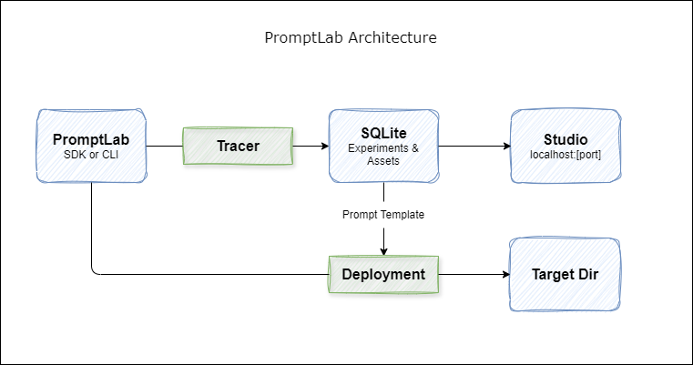

## Introduction

<h4>Welcome to PromptLab!</h4>

PromptLab is a free, lightweight, open-source experimentation tool for Gen AI applications. When we say `lightweight`, we truly mean lightweight - no cloud subscription, no additional servers, and even no docker. You are just one `pip install` away from evaluating your AI Agent or RAG application.

In regards to evaluator metrics, our motto is "bring your metrics". There are really mature open source evaluation libraries, PromptLab is designed to leverage those libraries.

## Architecture

PromptLab is designed to be extremely lightweight. The whole experience is packaged within a python library.

The tool can be used via python SDK or CLI. Developers can use the SDK/CLI to manage assets (prompt template and dataset) and expriments. .

The SDK/CLI can also launch the PromptLab Studio, a web interface that runs locally to compare expriments and track assets. Finally, it can be used to deploy prompt template to a target directory.

## Core Concepts

### Tracer

Tracer is storage that stores the assets and experiments. Currently only supported tracer is a `SQLite` based tracer. Initializing the PromptLab object will try to the load the SQLite database file. If the file doesn't exist, PromptLab will create the file.

### PromptLab Studio

PromptLab Studio is a web interface that shows the experiments and assets. It also helps to compare multiple expriments.

### Asset

Lifecycle of PromptLab starts from assets. Assets are artefacts used to design experiments. Assets are immutable. Once created they can't be changed, any attempt to update will create a new version of the same asset. Versioning starts from 0 and automatically incremented. 

There are two types of assets.

#### Prompt Template
A prompt template is a prompt with or without placeholders. The placeholders are replaced with actual data before sending to LLM. A prompt template has two parts - system prompt and user prompt. The placeholders are marked using `< >`. 

A sample prompt template -

    system_prompt = "You are a helpful assiStant who can answer questions from a given text."
    user_prompt = '''Here are some information. 
                    <context>

                    Answer this questions from the given information.
                    <question>'''

Here, `<context>` and `<question>` are placeholders that will be replaced with real data before sending to the LLM. PromptLab will search the dataset for columns with these exact names and use their values to replace the corresponding placeholders. Ensure that the dataset contains columns named `context` and `question` to avoid errors.

#### Dataset
A dataset is a jsonl file which is used to run the evaluation. It's mandatory to have an unique `id` column. PromptLab doesn't store the actual data, rather it only stores the metadata (file path, credentails etc.).

### Experiment
Experiment is at the center of PromptLab. An experiment means running a prompt for every record of the dataset and evaluating the outcome against some defined metrics. The dataset is provided as a jsonl file.

A sample experiment definition:

    experiment = {
        "model": {
            "type": "<model_type>",
            "api_key": "<your_api_key>",
            "api_version": "<api_version>",
            "endpoint": "<your_model_endpoint>",
            "inference_model_deployment": "<inference_model_name>",
            "embedding_model_deployment": "<embedding_model_name>"
        },
        "prompt_template": {
                "id": "<prompt_template_id>",
                "version": "<prompt_template_version>"
            },
        "dataset": {
                "id": "<dataset_id>",
                "version": "<dataset_version>"
            },
        "evaluation": [
            {
                "type": "<evaluation_library>",
                "metric": "<metric_name>",
                "column_mapping": {
                    "<evaluator_parameter_name>": "<dataset_column_name>",
                    ...
                    ...
                    "<evaluator_parameter_name>": "<dataset_column_name>"
                }
            }
        ]
    }

Now, let's take a look into the parts of the experiment definition.

#### Model

PromptLab needs two models to work properly. An inference model for prompt inference and some "LLM as judge" metrics. And an embedding model for generating embeddings for some metrics.

Fields definition:

- type (mandatory): valid values are `azure_openai`, `ollama` 
- api_key (optional)
- api_version (optional)
- endpoint (optional)
- inference_model_deployment (mandatory): deployment name of the inference model
- embedding_model_name (mandatory): deployment name of the embedding model

#### Evaluation

It is a list of evaluation metrics with column mapping. PromptLab's motto is "bring your metrics". 

Evaluation library integration -

| Library | Status |
|----------|----------|
| [RAGAS](https://www.ragas.io/) | Beta |
| [DeepEval](https://docs.confident-ai.com/) | Coming soon |

Fields definition:

- type (mandatory): valid vaules are `ragas`
- metric (mandatory): name of the metric from the specific library
- column_mapping (mandatory): column mapping to map the metric paramaeters with dataset columns and the inference output. To map a parameter to inference output, use `$inference`.