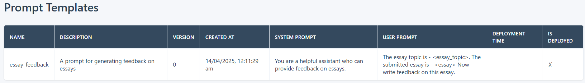
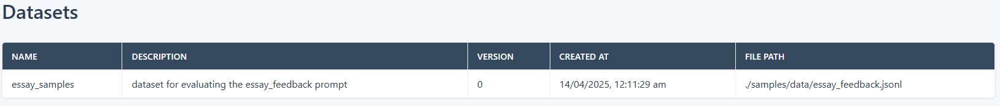
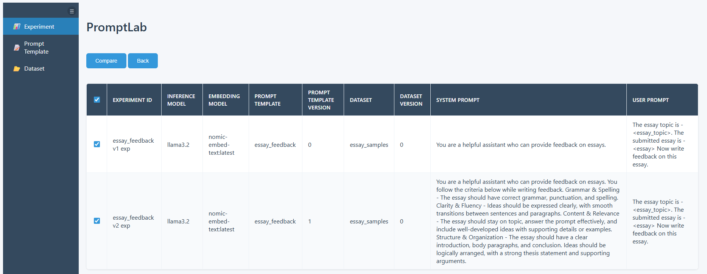

# Quickstart

This sample ([quickstart.py](quickstart.py)) demonstrate how to use PromptLab to evaluate a basic prompt to provide feedback to essays submitted by students. 

## Install python package

Install the python package using pip. It's highly recommended to use a virtual environment. 

    pip install promptlab

## Initialize PromptLab 

The frist step to use PromptLab, is to initialize the PromptLab object. PromptLab uses `sqlite` for database. Please check [Tracer](../../docs/README.md#tracer) to learn more about it.

In the [quickstart.py](quickstart.py), the `def create_prompt_lab(tracer_type: str, tracer_db_file_path: str) -> PromptLab:` function creates the PromptLab object.

Once the PromptLab object is ready, you can start the PromptLab Studio to check the assets and experiments.

    prompt_lab.studio.start(8000)

## Create a prompt template

A prompt template is a prompt with or without placeholders. Please check [Prompt Template](../../docs/README.md#prompt-template) to learn more about it.

In the [quickstart.py](quickstart.py), the `def create_prompt_template(prompt_lab: PromptLab) -> str:` method demonstrates how to create a prompt template.

A  prompt template has two main attributes - `system_prompt` and `user_prompt`. The sample prompt used in this example is -

    system_prompt_v1 = 'You are a helpful assistant who can provide feedback on essays.'
    user_prompt_v1 = '''Here is the essay topic. 
                    <essay_topic>

                    Here is the submitted essay.
                    <essay>
                    
                    Provide feedback on the essay.'''

Here, `<context>` and `<question>` are placeholders that will be replaced with real data before sending to the LLM. PromptLab will search the dataset for columns with these exact names and use their values to replace the corresponding placeholders. Ensure that the dataset contains columns named `context` and `question` to avoid errors.

## Create dataset

A dataset is a jsonl file to design the experiment. Please check [Dataset](../../docs/README.md#dataset) to learn more about it.

In the [quickstart.py](quickstart.py), the `def create_dataset(prompt_lab: PromptLab, file_path: str) -> str:` method demonstrates how to create a dataset.

## Create experiment

An experiment evaluates the outcome of a prompt against a set of metrics for a given dataset. Developers can modify hyperparameters (such as prompt template and models) and compare experiment results to determine the best prompt for deployment in production. Please check [Experiment](../../docs/README.md#experiment) to learn more about it.

In the [quickstart.py](quickstart.py), we are using the prompt template and dataset created in the previous steps to design an experiment. The `def create_experiment(prompt_lab: PromptLab, endpoint:str, prompt_template_id: str, prompt_template_version: int, dataset_id: str, dataset_version: int):
` method demonstrates how to create and run an expriment.

You can compare multiple experiments.

## Deploy prompt

Once the developer is happy with a prompt template, they can deploy it to production. Please check [Deployment](../../docs/README.md#deployment) to learn more about it. 

In the [quickstart.py](quickstart.py), the `deploy_prompt_template(prompt_lab: PromptLab)` method demonstrates how to deploy a prompt template.